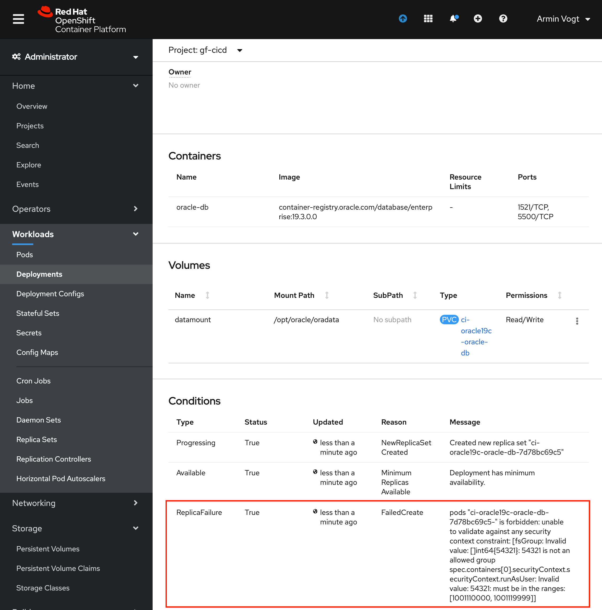

# Deploy and use Oracle 19 Database on OpenShift

This guide is condensed from the Oracle guide at https://github.com/oracle/docker-images/tree/main/OracleDatabase/SingleInstance/helm-charts/oracle-db

1. Install helm utility

    - On MacOS
    
          brew install helm
    
    - On Windows
    
          download exe from https://github.com/helm/helm/releases

1. Have access to an OpenShift 4 cluster
   
  >you will need to have cluster admin privilege in order to create a serviceaccount that grants 
  > `anyuid` privilege to the Oracle pod.

1. Clone this repository

       git clone https://github.com/avogt-sundn/oracle-on-openshift.git

1. Package the helm charts from this repository

       cd oracle-on-openshift
       helm package helm-charts/oracle-db

1. Create a namespace/project on openshift

    - my name: `gf-cicd` 
      
          oc project gf-cicd

1. Create a secret to acess Oracle registry to download their images
   
      - open your web browser and create an account at https://oracle.com 
      - use your credentials on creating this secret in the project
            
            oc create secret docker-registry regcred \
            --docker-server=container-registry.oracle.com \
            --docker-username=avogt@s-und-n.de \
            --docker-password=*** \
            --docker-email=avogt@s-und-n.de
    
1. Create a deployment, starting oracle

    - name for this oracle database is: `test-ora19c`
    - choose from the storage classes available on your cluster: allzones-ssd
      
          helm install test-ora19c oracle-db-1.0.0.tgz

1.  Check the results

    - the deployment was created with a suffix -oracle-db to your name: test-ora19c-oracle-db
     
          oc get deployment test-ora19c-oracle-db -o yaml

1. fix userid 
   >You need to be cluster admin in order to grant `anyuid` privilege

     - Oracle needs to run with user id 54321, as this is decoded in the Dockerfile via USER comand.
     - Grant any container running with that serviceaccount to set anyuid:
     - Set the required userid on the deployment, bringing the gained anyuid right to an effect:

           oc create serviceaccount oracle-sacc
           oc adm policy add-scc-to-user anyuid system:serviceaccount:gf-cicd:oracle-sacc\n
           oc patch deployment/test-ora19c-oracle-db --patch '{"spec":{"template":{"spec":{"serviceAccountName": "oracle-sacc"}}}}'

1. connect from your local machine

        oc port-forward deployment/ci-oracle19c-oracle-db  5500 1521

1. connect with your IDE to localhost:1521
1. open browser at localhost:5500

## Additional Information
### Output from helm install

    NAME: test-ora19c
    LAST DEPLOYED: Wed Mar 17 17:33:29 2021
    NAMESPACE: gf-cicd
    STATUS: deployed
    REVISION: 1
    NOTES:
    #
    # Copyright (c) 2020, Oracle and/or its affiliates. All rights reserved.
    # Licensed under the Universal Permissive License v 1.0 as shown at http://oss.oracle.com/licenses/upl.
    #
    
    # ===========================================================================
    # == Add below entries to your tnsnames.ora to access this database server ==
    # ====================== from external host =================================
    ORCLCDB=(DESCRIPTION=(ADDRESS=(PROTOCOL=TCP)(HOST=<ip-address>)(PORT=<port>))
    (CONNECT_DATA=(SERVER=DEDICATED)(SERVICE_NAME=<ORACLE_SID>)))
    ORCLPDB1=(DESCRIPTION=(ADDRESS=(PROTOCOL=TCP)(HOST=<ip-address>)(PORT=<port>))
    (CONNECT_DATA=(SERVER=DEDICATED)(SERVICE_NAME=<ORACLE_PDB>)))
    #
    #ip-address : IP address of any of the Kubernetes nodes
    #port       : Service Port that is mapped to the port 1521 of the container.
    #
    
    Application details
    ====================
    IP and port can be found using the following:
    
    export NODE_PORT=$(kubectl get --namespace gf-cicd -o jsonpath="{.spec.ports[0].nodePort}" services test-ora19c-oracle-db)
    export NODE_XDB_PORT=$(kubectl get --namespace gf-cicd -o jsonpath="{.spec.ports[1].nodePort}" services test-ora19c-oracle-db)
    export NODE_IP=$(kubectl get nodes --namespace gf-cicd -o jsonpath="{.items[0].status.addresses[0].address}")
    echo listener at $NODE_IP:$NODE_PORT
    echo XDB at $NODE_IP:$NODE_XDB_PORT
    
    Oracle Databases SID, PDB name can be figured out by :
    
    ORACLE_SID=$(kubectl get  -o jsonpath="{.spec.template.spec.containers[?(.name == 'oracle-db')].env[?(.name == 'ORACLE_SID')].value }" deploy test-ora19c-oracle-db)
    ORACLE_PDB=$(kubectl get  -o jsonpath="{.spec.template.spec.containers[?(.name == 'oracle-db')].env[?(.name == 'ORACLE_PDB')].value }" deploy test-ora19c-oracle-db)
# Troubleshooting
### "serviceaccount "oracle-sacc" not found"

Check the deployment yaml

        - type: ReplicaFailure
      status: 'True'
      lastUpdateTime: '2021-03-18T14:44:25Z'
      lastTransitionTime: '2021-03-18T14:44:25Z'
      reason: FailedCreate
      message: >-
        pods "racl-oracle-db-777c944b8c-" is forbidden: error looking up service
        account gf-cicd/oracle-sacc: serviceaccount "oracle-sacc" not found

The deployment references the needed serviceaccount, but you did not create one:

  - either create a service account with these commands if you are cluster admin

        oc project <yourproject>
        oc create serviceaccount oracle-sacc
        oc adm policy add-scc-to-user anyuid system:serviceaccount:<yourproject>:oracle-sacc

- or ask the cluster admin for a serviceaccount with anyuid privilege

### "54321 is not an allowed group"

Immediately after the helm install this message will show up at the deployment page (or the deployment.yaml)
  > pods "test-ora19c-oracle-db-7d78bc69c5-" is forbidden: unable to validate against any security context constraint: [fsGroup: Invalid value: []int64{54321}: 54321 is not an allowed group spec.containers[0].securityContext.securityContext.runAsUser: Invalid value: 54321: must be in the ranges: [1001110000, 1001119999]]

Fix it with these commands:
    
    oc project <yourproject>
    oc create serviceaccount oracle-sacc
    oc adm policy add-scc-to-user anyuid system:serviceaccount:<yourproject>:oracle-sacc
    oc patch deployment/test-ora19c-oracle-db --patch '{"spec":{"template":{"spec":{"serviceAccountName": "oracle-sacc"}}}}'

Check status:

    oc get deployment test-ora19c-oracle-db -o yaml
    ...
    status:
    conditions:
    - lastTransitionTime: "2021-03-17T16:33:32Z"
      lastUpdateTime: "2021-03-17T16:33:32Z"
      message: Deployment has minimum availability.
      reason: MinimumReplicasAvailable
      status: "True"
      type: Available
    - lastTransitionTime: "2021-03-17T16:33:32Z"
      lastUpdateTime: "2021-03-17T16:33:32Z"
      message: 'pods "test-ora19c-oracle-db-7d78bc69c5-" is forbidden: unable to validate
      against any security context constraint: [fsGroup: Invalid value: []int64{54321}:
      54321 is not an allowed group spec.containers[0].securityContext.securityContext.runAsUser:
      Invalid value: 54321: must be in the ranges: [1001110000, 1001119999]]'
      reason: FailedCreate
      status: "True"
      type: ReplicaFailure
    - lastTransitionTime: "2021-03-17T16:43:33Z"
      lastUpdateTime: "2021-03-17T16:43:33Z"
      message: ReplicaSet "test-ora19c-oracle-db-7d78bc69c5" has timed out progressing.
      reason: ProgressDeadlineExceeded
      status: "False"
      type: Progressing
      observedGeneration: 1
      unavailableReplicas: 1 
