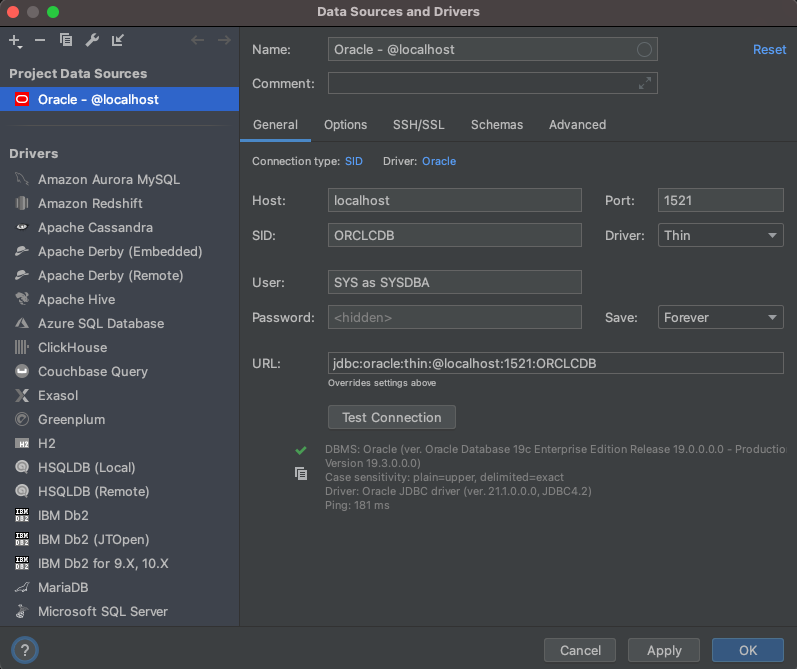

# oracle-on-openshift

Run the latest Oracle Database on OpenShift.

- fetching the latest image from Oracle as it is released
- setting it up to be confined to moderate resource utilization

## Getting the image

1. You will need a login at oracle.com
        
2. create an openshift secret named oracle-pull-secret
    
       oc create secret docker-registry oracle-pull-secret \
                    --docker-server=container-registry.oracle.com \
                    --docker-username=avogt@dummy.com \
                    --docker-password=**** \ 
                    --docker-email=avogt@dummy.com
3. link the secret so that it will be used for pulling images
   
       oc secrets link default oracle-pull-secret  --for=pull\n
       oc secrets link builder oracle-pull-secret
4. create an imagestream referencing the oracle image
   
       oc import-image database/enterprise:latest \
               --from=container-registry.oracle.com/database/enterprise:latest \
               --confirm

## Deploying Oracle 

Oracle needs to run with user id 54321, as this is decoded in the Dockerfile via USER comand.

    oc create sa oracle-sacc
    oc adm policy add-scc-to-user anyuid system:serviceaccount:gf-cicd:oracle-sacc\n
    oc patch deployment/enterprise --patch '{"spec":{"template":{"spec":{"serviceAccountName": "oracle-sacc"}}}}'

Deployment will restart after patching.

Now look after the pod

    oc get pod
    NAME                                  READY   STATUS    RESTARTS   AGE
    enterprise-77b6d84bd9-sxq8j           1/1     Running   0          12m
    
... and look into the log:

    oc logs  enterprise-77b6d84bd9-sxq8j
    [2021:03:17 12:30:10]: Acquiring lock on /opt/oracle/oradata/.ORCLCDB.create_lck
    [2021:03:17 12:30:10]: Lock acquired on /opt/oracle/oradata/.ORCLCDB.create_lck
    [2021:03:17 12:30:10]: Holding on to the lock using /tmp/.ORCLCDB.create_lck
    ORACLE EDITION: ENTERPRISE
    ORACLE PASSWORD FOR SYS, SYSTEM AND PDBADMIN: +YHmY+9sdUQ=1
    
    LSNRCTL for Linux: Version 19.0.0.0.0 - Production on 17-MAR-2021 12:30:10
    
    Copyright (c) 1991, 2019, Oracle.  All rights reserved.
    
    Starting /opt/oracle/product/19c/dbhome_1/bin/tnslsnr: please wait...
    
    TNSLSNR for Linux: Version 19.0.0.0.0 - Production
    System parameter file is /opt/oracle/product/19c/dbhome_1/network/admin/listener.ora
    Log messages written to /opt/oracle/diag/tnslsnr/enterprise-77b6d84bd9-sxq8j/listener/alert/log.xml
    Listening on: (DESCRIPTION=(ADDRESS=(PROTOCOL=ipc)(KEY=EXTPROC1)))
    Listening on: (DESCRIPTION=(ADDRESS=(PROTOCOL=tcp)(HOST=0.0.0.0)(PORT=1521)))
    
    Connecting to (DESCRIPTION=(ADDRESS=(PROTOCOL=IPC)(KEY=EXTPROC1)))
    STATUS of the LISTENER
    ------------------------
    Alias                     LISTENER
    Version                   TNSLSNR for Linux: Version 19.0.0.0.0 - Production
    Start Date                17-MAR-2021 12:30:10
    Uptime                    0 days 0 hr. 0 min. 0 sec
    Trace Level               off
    Security                  ON: Local OS Authentication
    SNMP                      OFF
    Listener Parameter File   /opt/oracle/product/19c/dbhome_1/network/admin/listener.ora
    Listener Log File         /opt/oracle/diag/tnslsnr/enterprise-77b6d84bd9-sxq8j/listener/alert/log.xml
    Listening Endpoints Summary...
    (DESCRIPTION=(ADDRESS=(PROTOCOL=ipc)(KEY=EXTPROC1)))
    (DESCRIPTION=(ADDRESS=(PROTOCOL=tcp)(HOST=0.0.0.0)(PORT=1521)))
    The listener supports no services
    The command completed successfully
    Prepare for db operation
    8% complete
    Copying database files
    31% complete
    Creating and starting Oracle instance
    32% complete
    36% complete
    40% complete
    43% complete
    46% complete
    Completing Database Creation
    ➜  ~

In the top output of the log you can find

    ORACLE PASSWORD FOR SYS, SYSTEM AND PDBADMIN: +YHmY+9sdUQ=1
.. and the DB identifier is:

    System Identifier(SID):ORCLCDB

